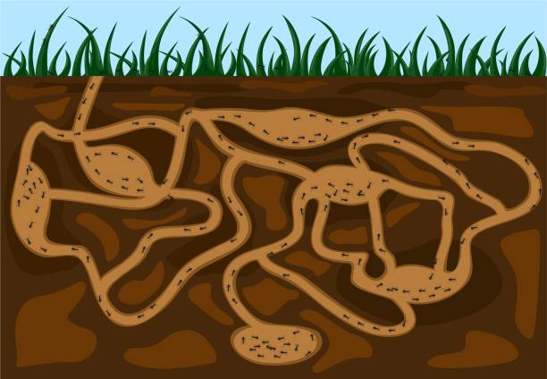

<div id="top"></div>

<div align="center">
	<a href="https://github.com/Link-Wolf/lem_in" title="Go to GitHub repo"></a>
	<a href="https://"></a>
	<a href="https://"></a>
	<a href="https://www.linux.org/" title="Go to Linux homepage"></a>
	</br>
	<a href="https://github.com/Link-Wolf/lem_in/stargazers"></a>
	<a href="https://github.com/Link-Wolf/lem_in/network/members"></a>
	<a href="https://github.com/Link-Wolf/lem_in/issues"></a>
</div>

<!-- PROJECT LOGO -->
<br />
<div align="center">
  <a>
    
  </a>

  <h3 align="center">lem_in</h3>

  <p align="center">
	  <em>42Stein 3D</em><br/>
    Elementary algorithmic project to code an ant farm manager with <a href="https://github.com/sur4c1">iCARUS</a>
    <br />
    <br />
    <a href="https://github.com/Link-Wolf/lem_in/issues">Report Bug</a>
    ·
    <a href="https://github.com/Link-Wolf/lem_in/issues">Request Feature</a>
  </p>
</div>

<!-- TABLE OF CONTENTS -->
<details>
  <summary>Table of Contents</summary>
  <ol>
    <li>
      <a href="#about-the-project">About The Project</a>
      <ul>
        <li>
          <a href="#bonus-features">Bonus Features</a>
        </li>
      </ul>
    </li>
    <li>
      <a href="#getting-started">Getting Started</a>
      <ul>
        <li><a href="#prerequisites">Prerequisites</a></li>
        <li><a href="#installation">Installation</a></li>
      </ul>
    </li>
    <li><a href="#usage">Usage</a></li>
    <li><a href="#roadmap">Roadmap</a></li>
    <li><a href="#contributing">Contributing</a></li>
  </ol>
</details>

<!-- ABOUT THE PROJECT -->

## About The Project

<div align="center">
  <a>
    
  </a>
</div>
</br>

This project consists of simulating an ant farm. A farm consists of a series of rooms linked together by tubes. Each room can be linked to an unlimited number of rooms and tubes can only link two rooms together.

The goal is to find the quickest way to get `n` ants across the farm. At the beginning of the simulation, all the ants are in the room `##start`. The goal is to bring them to the room `##end` using the least amount of turns. Each room can only contain one ant at a time (except at `##start` and `##end` which can contain as many ants as necessary).
The program takes a file as a parameter that describes the farm. The file is formatted as follows :

```
	number_of_ants
	the_rooms
	the_links
```

Here's an example of a simple farm :

```
	##start
	1 23 3
	2 16 7
	#comment
	3 16 3
	4 16 5
	5 9 3
	6 1 5
	7 4 8
	##end
	0 9 5
	0-4
	0-6
	1-3
	4-3
	5-2
	3-5
	#another comment
	4-2
	2-1
	7-6
	7-2
	7-4
	6-5
	#another comment
```

It is important to note that the rooms are defined by their name, their coordinates, and their type (`##start`, `##end`, or nothing). The links are defined by the names of the rooms they link.
The file can contain comments, which are lines that start with `#`.
BUT a line that starts with `##` is an instruction modifying the properties of the following room. For example, `##start` indicates that the following room will be the start room.
The previous map can be represented as follows :

```
          _______________
         /               \
  ______[5]----[3]----[1] |
 /       |           /    |
[6]-----[0]----[4]  /     |
 \   _________/ |  /      |
  \ /          [2]/_______/
  [7]_________/
```

The output of the program must be formatted as follows :

```
	number_of_ants
	the_rooms
	the_links

	Lx-y Lz-w Lr-o ...
```

Where `x`, `z`, `r`, ... are the ants' numbers (going from 1 to `number_of_ants`) and `y`, `w`, `o`, ... are the rooms' names. Each line corresponds to a turn.

### Bonus features

While the basic output is not that easy to read, we added a visualizer to make it more understandable. More precisely, we used the MLX42 library to create a representation of the farm.

<div align="center">
  <a>
    
  </a>
</div>
</br>

<p align="right">(<a href="#top">back to top</a>)</p>

<!-- GETTING STARTED -->

## Getting Started

It's a C project but as we use the MLX42 library (included in the project), you may need to install some openGL and X11 libraries</br>

### Prerequisites

Having a C compiler like cc, gcc or clang</br>

### Installation

1. Clone the repo
    ```sh
    git clone https://github.com/Link-Wolf/lem_in.git
    ```
2. Compile lem_in
    ```sh
    cd lem_in; make
    ```
3. Execute the program either with a properly formatted map file or without anything (you'll need to enter the map manually) then stop the input with `CTRL+D`
    ```sh
    ./lem_in {your file}
    ```

<p align="right">(<a href="#top">back to top</a>)</p>

<!-- USAGE EXAMPLES -->

## Usage

```sh
	./lem-in [ -h | --help ] [ -v | --verbose ] < map_file

	NOTE: map_file can be replaced by the map generator as follow:
		./generator_linux [ --flow-one | --flow-ten | --flow-thousand | --big | --big-superposition ] | ./lem-in [ -h | --help ] [ -v | --verbose ]
```

    - `-h` or `--help` : display the help message
    - `-v` or `--verbose` : add comments to the output to make it more readable
    - `map_file` : the file containing the map of the farm
    - `generator_linux` : a map generator that is included in the project

If you want to use the visualizer :

```sh
	./visualiser [ -h | --help ] [ -d | --debugger ] < map_file

	NOTE: map_file can be replaced by the map generator as follow:
		./generator_linux [ --flow-one | --flow-ten | --flow-thousand | --big | --big-superposition ] | ./visualiser [ -h | --help ] [ -d | --debugger ]
	NOTE2: without the -d (--debugger) option, please only use maps contained under /bonus_maps
```

    - `-h` or `--help` : display the help message
    - `-d` or `--debugger` : display the debugger to see the ants' movements
    - `map_file` : the file containing the map of the farm
    - `generator_linux` : a map generator that is included in the project

**NOTE**: As the debugger exists to help you understand the movements of the ants, it is not recommended to use it with maps that are not under the `/bonus_maps` directory, as theses specific maps are designed for the debugger.

<p align="center">
  
  
</p>

<p align="right">(<a href="#top">back to top</a>)</p>

<!-- ROADMAP -->

## Roadmap

-   [x] Add bonus features and visualizers

See the [open issues](https://github.com/Link-Wolf/lem_in/issues) for a full list of proposed features (and known issues).

<p align="right">(<a href="#top">back to top</a>)</p>

<!-- CONTRIBUTING -->

## Contributing

If you have a suggestion that would make this better, please fork the repo and create a pull request. You can also simply open an issue with the tag "enhancement".
Don't forget to give the project a star! Thanks again!

1. Fork the Project
2. Create your Feature Branch (`git checkout -b feature/AmazingFeature`)
3. Commit your Changes (`git commit -m 'Add some AmazingFeature'`)
4. Push to the Branch (`git push origin feature/AmazingFeature`)
5. Open a Pull Request

<p align="right">(<a href="#top">back to top</a>)</p>
